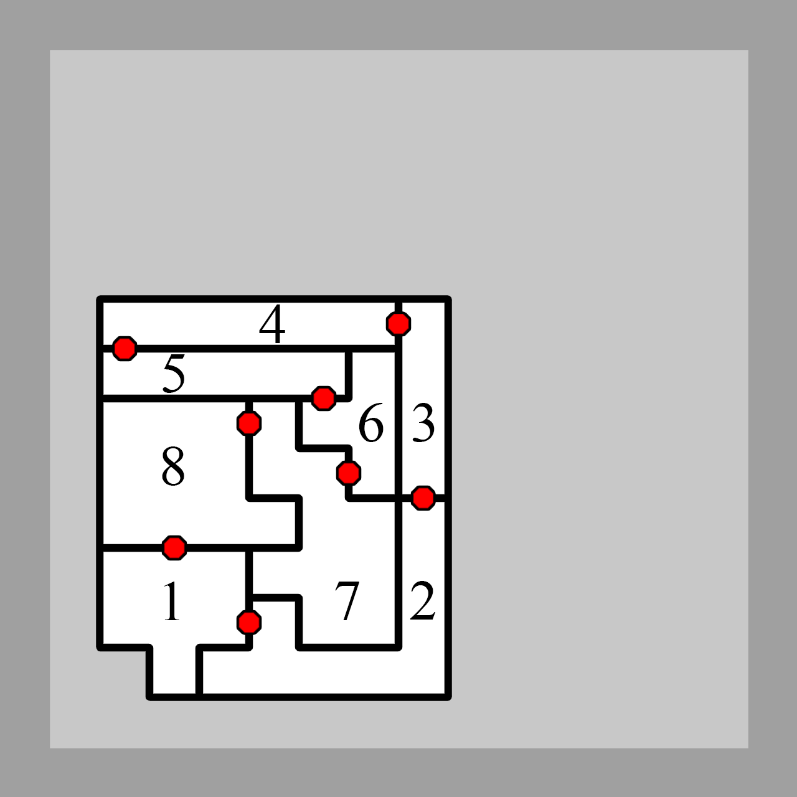
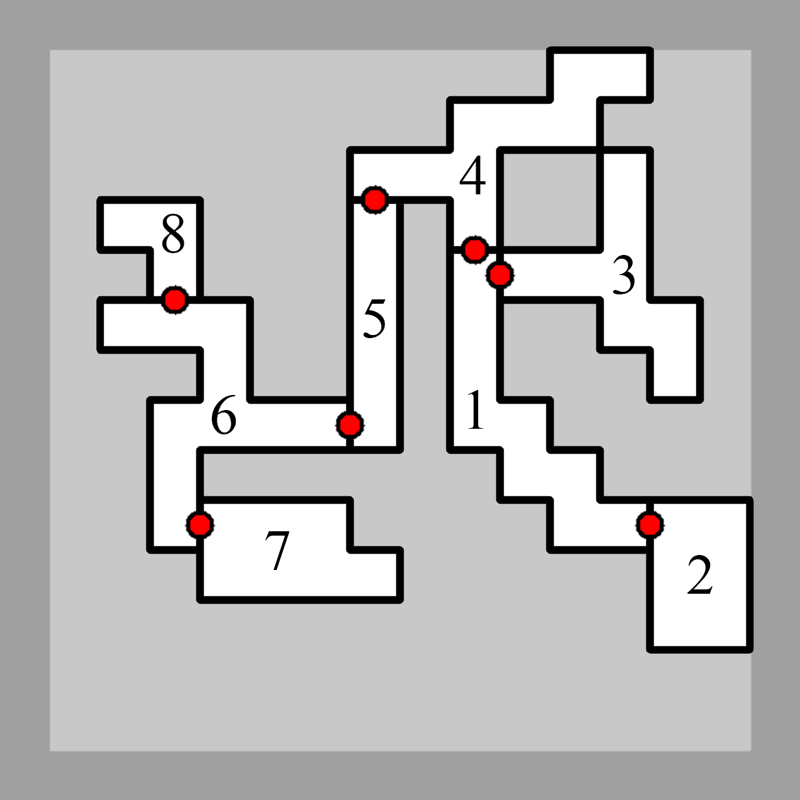

This repository contains the source-code that was developed for, and used in, _"A General-Purpose Expressive Algorithm for Room-based Environments"_ (Konstantinos Sfikas, Antonios Liapis and Georgios N. Yannakakis, in Proceedings of the 13th workshop on Procedural Content Generation (PCG2022)).
It includes a novel, constrained Quality-Diversity algorithm, *FI-MAP-Elites*, and its application to the problem of generating room-based environments with topological and geometric constraints.
The source code can be used to reproduce the experiment results or to expand on the proposed methodology. 

You may find the full paper here: [download link coming soon!]

Citation (BibTeX):
```
@inproceedings{sfikas2022ageneral,
	author={Konstantinos Sfikas and Antonios Liapis and Georgios N. Yannakakis},
	title={A General-Purpose Expressive Algorithm for Room-based Game Levels},
	booktitle={Proceedings of the 13th workshop on Procedural Content Generation (PCG2022)},
	year={2022}
}
```

# "A General-Purpose Expressive Algorithm for Room-based Environments" - Paper overview

## Abstract
This paper presents a generative architecture for general-purpose room-based environments that can be treated as geometric definitions of game-levels such as dungeons, mansions, shooter levels and more. The motivation behind this work is to provide a level design tool that combines aspects of *controllability*, *expressivity* and *generality*. Towards that end, a two-tier level representation is realized, with a graph-based *design specification* constraining and guiding the generated geometries, facilitated by constrained evolutionary search. Expressivity is secured through quality-diversity search which can provide the designer with a broad variety of level layouts to choose from. Finally, the generator is general-purpose as it can produce layouts based on different types of static grid structures or as free-form, curved structures through an adaptive Voronoi diagram that is evolved along with the level itself. The method is tested on a variety of design specifications and grid types and results show that even with complex design constraints or malleable grids the algorithm can produce a broad variety of levels.

## Algorithm

Feasible-Infeasible Multidimensional Archives of Phenotypic Elites (FI-MAP-Elites) is a hybrid of the MAP-Elites <a href="#mouret2015is">[1]</a>  and FI-2Pop GA <a href="#kimbrough2008oa">[2]</a> algorithms. Its main goal is to combine the illumination capabilities of the former with the constraint-solving capabilities of the latter. FI-MAP-Elites discretizes the behavioral space, similar to MAP-Elites, but retains two archives of elites (one for feasible and one for infeasible elites). Cells of each archive store a single individual. Importantly, the survival criterion for the feasible archive is the individual’s fitness, while for the infeasible archive it is its feasibility score, similar to FI-2Pop GA. In each iteration, FI-MAP-Elites performs the following steps (shown in fig. 1). First, an individual is selected from a random cell of either the feasible or the infeasible archive, alternating between the two when both archives are non-empty. An offspring of the selected individual is produced via mutation. If the offspring is feasible, it is evaluated (fitness & BCs) and placed in the feasible archive, otherwise it is evaluated (feasibility score & BCs) and placed in the infeasible archive.

<table>
  <tr>
    <td></td>
  </tr>
  <tr>
    <td>Figure 1: A single iteration of the FI-MAP-Elites algorithm</td>
  </tr>
</table>

## Content Representation
The levels generated by our approach form different regions that we identify as "rooms"; however, this could include any partition with hard boundaries and one way of accessing it, such as elevated terrain in *Starcraft* (Blizzard, 1998) or islands with bridges in *Heroes of Might and Magic II* (3DO, 1996). Different rooms are separated by walls, and two adjacent rooms can be connected with a door. Importantly, the generator produces the level geometry (currently as a top-down 2D layout) that adheres to a high-level specification of the level. This dual representation, from the high-level *Design Specification* to the geometric *Design Implementation* is described below.

### Design Specification
A Design Specification (DS) is an abstract description of the layout that is to be generated. It contains an undirected graph whose vertices represent a set of rooms and whose edges represent a direct connection between a pair of rooms through a door. Each vertex (room) is also assigned with an area that this room should occupy. A DS is a critical part of the design constraints and is utilized in various parts of our algorithmic approach, including the initialization, mutation and evaluation methods. An example of a Design Specification is shown in Fig. 2a.

### Design Implementation
A Design Implementation (DI) is the geometry that matches the provided DS, produced by the generator. In our implementation it consists of three hierarchically dependent layers of information: 
- **Layer 1 (L1)** describes the Voronoi tessellation of a 2D rectangle, whose cells become the building blocks for the shape of rooms and levels (as shown in Fig. 2b).
- **Layer 2 (L2)** describes the rooms' placement on the 2D plane and their exact shape (as shown in Fig. 2c).
- **Layer 3 (L3)** describes the walls and doors, as well as the resulting connectivity graph of the interior space (as shown in Fig. 2d).

<table>
    <tr>
        <td width="50%">  </td>
        <td width="50%">  </td>
    </tr>
    <tr>
        <td> Figure 2a: Design Specification with 5 rooms and 4 doors. </td>
        <td> Figure 2b: Design Implementation - Layer 1 (L1). </td>
    </tr>
    <tr>
    </tr>
    <tr>
        <td>  </td>
        <td>  </td>
    </tr>
    <tr>
        <td> Figure 2c: Design Implementation - Layer 2 (L2). </td>
        <td> Figure 2d: Design Implementation - Layer 3 (L3). </td>
    </tr>
    <tr>
        <td colspan = "2"> Figure 2: A Design Specification and the three layers of information (L1, L2, L3) of a feasible Design Implementation. </td>
    </tr>
</table>

## Indicative Results

We examine two Behavioral Characterizations (BCs) as measures of diversity among the generated DIs. This results in a two-dimensional feature-map for the feasible population (and another feature-map for the infeasible), which is useful for visualizing the archive of maps to a designer. Both BCs are based on the notion of compactness (*C*), a unit-less measure that expresses the relation between a shape’s perimeter and its area. The formula for compactness is shown in Eq. (1), but each BC uses this formula with different variables.

<table>
  <tr>
    <td></td>
  </tr>
  <tr>
    <td>Equation 1</td>
  </tr>
</table>

The BCs are as follows:
- Plan Compactness (Cp) expresses the compactness of a level as a whole, accounting its external borders (walls). Cp is calculated via Eq. (2), setting *A* as the total area of all rooms and *Π* as the outer perimeter of the layout, disregarding borders between rooms. 
- Average Room Compactness (Cr) expresses the average compactness of each room. A room’s compactness is calculated via Eq. (2), by setting *A* as the total area of the room in the DI and *Π* as the room’s perimeter considering borders between rooms, doors, and the outer perimeter. Note that if a room (or the entire layout) is missing from the DI, its compactness is 0; thus we can still calculate these BCs for infeasible individuals.

To showcase the type of levels generated with the different grid types and BCs, we show some example layouts generated for two different Design Specifications: a Cycle graph of order 8 (Table 1) and a Double Star graph of order 8 (Table 2). We examine both DIs on fixed grids (Ortho and Hex), as well as on the dynamic (co-evolved) Voronoi tessellation. The four levels shown per case are selected from the edges of the possibility space (with highest or lowest BC values) in order to showcase the diversity of the possible DIs for the same DS. 

<table>
    <tr>
        <td>  </td>
        <td> Maximum Compactness </td>
        <td> Minimum Compactness </td>
        <td> Maximum Compactness Per Room </td>
        <td> Minimum Compactness Per Room </td>
    </tr>
    <tr>
        <td> ORTHO </td>
        <td>  </td>
        <td>  </td>
        <td>  </td>
        <td>  </td>
    </tr>
    <tr>
        <td> HEX </td>
        <td>  </td>
        <td>  </td>
        <td>  </td>
        <td>  </td>
    </tr>
    <tr>
        <td> Voronoi </td>
        <td>  </td>
        <td>  </td>
        <td>  </td>
        <td>  </td>
    </tr>
    <tr>
        <td colspan="4"> Table 1: Sample levels for a DS based on a Cycle graph of order 8 (right), using Square, Hex and Voronoi grids. Samples were selected among those with the highest and lowest <i>Cp</i> values and the highest and lowest <i>Cr</i> values, in that order.</td>
        <td>  </td>
    </tr>
</table>

<table>
    <tr colspan="5"><b>Double Star</b> graph of order 8</tr>
    <tr>
        <td>  </td>
        <td> Maximum Compactness </td>
        <td> Minimum Compactness </td>
        <td> Maximum Compactness Per Room </td>
        <td> Minimum Compactness Per Room </td>
    </tr>
    <tr>
        <td> ORTHO </td>
        <td>  </td>
        <td>  </td>
        <td>  </td>
        <td>  </td>
    </tr>
    <tr>
        <td> HEX </td>
        <td>  </td>
        <td>  </td>
        <td>  </td>
        <td>  </td>
    </tr>
    <tr>
        <td> Voronoi </td>
        <td>  </td>
        <td>  </td>
        <td>  </td>
        <td>  </td>
    </tr>
    <tr>
        <td colspan="4"> Table 2: Sample levels for a DS based on a Double Star graph of order 8 (right), using Square, Hex and Voronoi grids. Samples were selected among those with the highest and lowest <i>Cp</i> values and the highest and lowest <i>Cr</i> values, in that order.</td>
        <td>  </td>
    </tr>
</table>

### References

<a id="mouret2015is"></a>
[1] Mouret, Jean-Baptiste, and Jeff Clune. "Illuminating search spaces by mapping elites." arXiv preprint arXiv:1504.04909 (2015).

<a id="kimbrough2008oa"></a>
[2] Kimbrough, Steven Orla, et al. "On a feasible–infeasible two-population (fi-2pop) genetic algorithm for constrained optimization: Distance tracing and no free lunch." European Journal of Operational Research 190.2 (2008): 310-327.